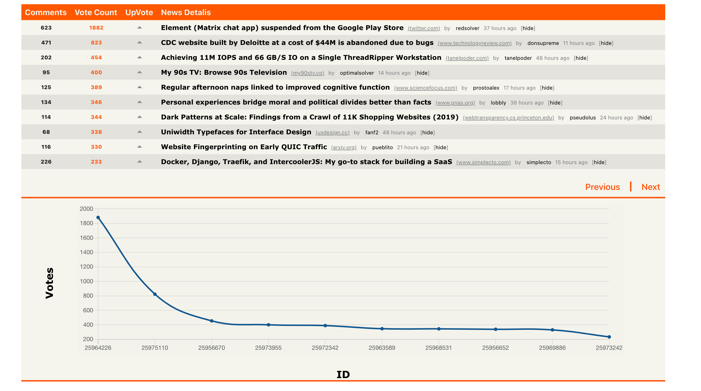

# HackerNews Clone

***Context***: 
Hacker News is a community started by Paul Graham for sharing "Anything that good hackers would find interesting. That includes more than hacking and startups. If you had to reduce it to a sentence, the answer might be: anything that gratifies one's intellectual curiosity."  Link: (https://news.ycombinator.com/)

***Functionalities***:
1. Upvote (maintain upvotes using in-browser storage APIs – no service integration, but keep the functionality such that it can be replaced with an service with minimal code change). Can add as many upvotes as you wish.
2. Hide functionality to remove the news from user’s view.
3. Prev | Next link should get the relevant data.
4. Plot of timeline with the News ID as the x axis and votes on the Y axis. This will match the data in the details table above it. 
5. The timeline chart is updated real time as and when the upvote is clicked.
6. *ALL MODIFIED DATA* like hide and Upvotes – are persisted and does not reset on browser refresh.

***Visual Appearance***:

## Available Scripts

In the project directory, you can run:

### `yarn start`

Runs the app in the development mode. 
Open [http://localhost:3000](http://localhost:3000) to view it in the browser.

The page will reload if you make edits. 
You will also see any lint errors in the console.

### `yarn test`

Launches the test runner in the interactive watch mode. 
See the section about [running tests](https://facebook.github.io/create-react-app/docs/running-tests) for more information.

### `yarn build`

Builds the app for production to the `build` folder. 
It correctly bundles React in production mode and optimizes the build for the best performance.

The build is minified and the filenames include the hashes. 
Your app is ready to be deployed!

See the section about [deployment](https://facebook.github.io/create-react-app/docs/deployment) for more information.

### `yarn eject`

**Note: this is a one-way operation. Once you `eject`, you can’t go back!**

If you aren’t satisfied with the build tool and configuration choices, you can `eject` at any time. This command will remove the single build dependency from your project.

Instead, it will copy all the configuration files and the transitive dependencies (webpack, Babel, ESLint, etc) right into your project so you have full control over them. All of the commands except `eject` will still work, but they will point to the copied scripts so you can tweak them. At this point you’re on your own.

You don’t have to ever use `eject`. The curated feature set is suitable for small and middle deployments, and you shouldn’t feel obligated to use this feature. However we understand that this tool wouldn’t be useful if you couldn’t customize it when you are ready for it.
